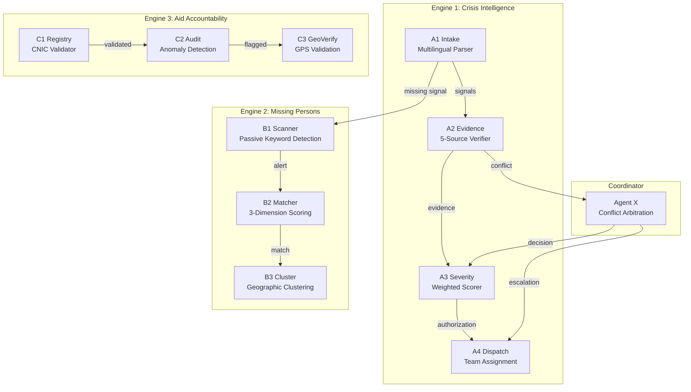

# Gaon Guard AI — Google Antigravity Hackathon, Challenge 3

> **⚠️ ALL DATA IN THIS PROJECT IS SYNTHETIC DEMO DATA. No real individuals are represented.**

## Overview

Gaon Guard AI is a **3-engine agentic crisis intelligence system** built for rural Pakistan's disaster response, featuring 11 autonomous Antigravity agents that process multilingual complaints, verify evidence across 5 data sources, dispatch teams using Haversine-based proximity, detect missing persons via camp registration matching, and audit aid distributions for fraud in real time. The system uses a **Coordinator Agent (X)** to arbitrate conflicts between agents — for example, when a flood complaint contradicts weather data showing 0mm rainfall — generating multiple hypotheses and making justified hold/proceed decisions. All 11 agents run on Google's Antigravity platform with full trace logging, enabling transparent, auditable crisis response that replaces manual processes taking hours with agentic decisions in under 30 seconds.

## Architecture



## Data Schemas

| Dataset | File | Fields | Records | Purpose |
|---|---|---|---|---|
| Villages | `villages.json` | id, name, district, province, lat, lng, population, households, risk_zone, nearest_bhu, flood_history[] | 50 | Village master data with GPS coordinates and risk zones |
| Weather | `weather.json` | district, date, rainfall_mm_24hr, temp_max, temp_min, humidity, flood_warning, source | 10 | Weather data for evidence verification by A2 |
| Teams | `teams.json` | id, name, department, type, base_lat, base_lng, status, district, phone | 9 | Response teams for Haversine-based dispatch by A4 |
| Health Reports | `health_reports.json` | district, village_id, disease, cases, severity, date, source | 12 | Health data for evidence cross-checking |
| Missing Persons | `missing_persons.json` | id, name, age, gender, last_seen_village, description, status, family_phone | 5 | Active missing person cases for B1-B3 |
| Camp Registrations | `camp_registrations.json` | id, camp_name, person_name, age, gender, status, description, gps | 20 | Camp records matched against missing persons |
| Beneficiary Registry | `beneficiary_registry.json` | cnic, head_name, village_id, household_size, damage_level, entitlement | 15 | Aid beneficiary records for C1 validation |
| Market Prices | `market_prices.json` | item, price_pkr, district, date, source | 8 | Market prices for C2 price gouging detection |
| Road Status | `road_status.json` | village_id, road_name, status, last_updated | 10 | Road conditions for evidence and ETA calculation |

## Tools and APIs Used

### Google Antigravity
All 11 agents hosted on Antigravity with full trace logging:
- **A1-A4**: Crisis intelligence pipeline (intake → evidence → severity → dispatch)
- **B1-B3**: Missing persons detection (scan → match → cluster)
- **C1-C3**: Aid accountability (registry → audit → geoverify)
- **X**: Coordinator/arbitration agent for conflict resolution

### Firebase
- **Cloud Firestore**: Real-time database for crisis events, dispatch tickets, missing persons, audit logs, and agent traces
- **Cloud Messaging (FCM)**: SMS simulation for notifications to field workers and families

### Backend & Mobile
- **FastAPI** (Python): REST API serving mock data and agent endpoints
- **Flutter**: 10-screen mobile app with animations (flutter_animate, shimmer)
- **Google Fonts**: Poppins (headings) + Roboto (body)

### API Endpoints

| Method | Endpoint | Purpose |
|---|---|---|
| GET | `/api/villages` | List all 50 villages with GPS |
| GET | `/api/weather/{district}` | Weather data for evidence check |
| GET | `/api/teams` | Available response teams |
| GET | `/api/health/{district}` | Health reports for evidence |
| GET | `/api/missing` | Active missing person cases |
| GET | `/api/camps` | Camp registration records |
| GET | `/api/beneficiaries/{village_id}` | Beneficiary registry |
| POST | `/api/crisis/create` | Create new crisis event |
| POST | `/api/notify` | Send SMS/FCM notification |
| POST | `/api/demo/edge_case/{n}` | Trigger edge case 1-6 |
| GET | `/api/demo/traces` | Get all agent trace entries |
| GET | `/api/demo/edge_cases` | List available edge cases |
| GET | `/api/stats/baseline` | Live stats for before/after |

## Antigravity Role

Antigravity is **not** used as a simple API wrapper. It serves as the **autonomous reasoning backbone** of the entire system:

1. **Parallel Agent Execution**: A1 and B1 run simultaneously on the same complaint — A1 extracts crisis signals while B1 scans for missing person keywords. This parallel execution is only possible because Antigravity manages agent lifecycle independently.

2. **Trace Logging**: Every agent decision is logged with full reasoning text, input/output summaries, tool call counts, and timestamps. This creates an auditable chain of evidence that can be reviewed by operators and oversight bodies.

3. **Coordinator Arbitration**: When A2's evidence check contradicts A1's signal extraction (e.g., flood claim vs. 0mm rainfall), Antigravity's Agent X fires automatically, generating multiple hypotheses and making a justified hold/proceed decision. This conflict resolution cannot be replicated with a static decision tree.

4. **Error Recovery**: When teams fail to move (Edge Case 4), Antigravity detects the non-movement through GPS monitoring, fires escalation sequences, and autonomously reassigns to the next nearest team — all without human intervention.

5. **Without Antigravity**: The system would degrade to a static rule engine with hardcoded thresholds, no conflict resolution, no parallel processing, and no explainable reasoning.

## Setup Steps

1. **Clone the repository**
   ```bash
   git clone https://github.com/Rahim36712/gao_ai.git
   cd gao_ai
   ```

2. **Install Python dependencies**
   ```bash
   cd backend
   pip install -r requirements.txt
   ```

3. **Start the FastAPI server**
   ```bash
   uvicorn main:app --reload --port 8000
   ```

4. **Set your Gemini API key** (for Antigravity agents)
   ```bash
   # PowerShell
   $env:GEMINI_API_KEY="AIzaSyYOUR_KEY_HERE"
   # Bash
   export GEMINI_API_KEY="AIzaSyYOUR_KEY_HERE"
   ```

5. **Run agent test pipelines**
   ```bash
   cd antigravity
   python test_a1_a3.py   # Crisis intelligence
   python test_a4_x.py    # Dispatch + coordinator
   python test_b1_b3.py   # Missing persons
   python test_c1_c3.py   # Aid accountability
   ```

6. **Configure Firebase** (optional — system falls back to mock data)
   - Place `serviceAccountKey.json` in `backend/`
   - Run `python firestore_seed.py` to seed collections

7. **Run Flutter mobile app**
   ```bash
   cd mobile
   flutter pub get
   flutter run
   ```

8. **Load demo scenario**: On Screen 1, tap "Demo Mode" to trigger any of the 6 pre-staged edge cases.

## Assumptions and Limitations

### Assumptions
1. Complaints are submitted in Urdu, Roman Urdu, or English — no other languages supported
2. Village GPS coordinates are accurate to within 500m of actual centroids
3. Weather data from PMD stations is updated at least every 6 hours
4. Response teams have mobile devices with GPS and network connectivity
5. CNIC format follows NADRA standard: XXXXX-XXXXXXX-X (13 digits + 2 dashes)
6. Rural road speeds average 40km/h for ETA calculations
7. Camp registrations are digitized at intake — no paper-only records
8. Each household receives at most 1 tent, regardless of household size (NDMA guideline)
9. SMS delivery to rural areas has at least 80% success rate within 5 minutes
10. District officers have authority to override agent decisions

### Limitations
1. **Offline mode not supported** — requires internet connectivity for all agent operations
2. **NADRA not integrated** — CNIC validation is format-only, no real identity verification
3. **Real GPS devices required** — GPS auto-capture in the app is simulated in demo
4. **Single language model** — uses Gemini 2.5 Flash; no fallback model configured
5. **No end-to-end encryption** — complaint data is transmitted in plaintext
6. **Firebase dependency** — real-time features require active Firestore connection
7. **No offline caching** — Flutter app does not cache data for disconnected use
8. **Weather data accuracy** — relies on mock data; real PMD API integration pending

## Privacy Note

**All data in this project is synthetic and generated for demonstration purposes only.**

- All CNICs (e.g., 42101-1234567-1) are fabricated and do not correspond to real individuals
- All names (e.g., Abdul Rehman, Hassan Ali) are common Pakistani names used fictitiously
- All phone numbers are placeholder values
- All village coordinates are approximate and do not identify real households
- All case IDs, officer IDs, and ticket IDs are randomly generated
- No real crisis events, missing persons, or aid distributions are represented

## Baseline Comparison

| Capability | Before Gaon Guard AI | After Gaon Guard AI |
|---|---|---|
| **Complaint Processing** | Manual reading, language barriers, 2-4 hour delay | A1 parses Urdu/Roman Urdu/English in <2 seconds |
| **Evidence Verification** | Phone calls to officials, anecdotal, 1-2 days | A2 checks 5 data sources in parallel in <3 seconds |
| **Severity Scoring** | Subjective guessing, prone to political bias | A3 applies weighted scoring with auditable trace |
| **Team Dispatch** | Radio calls, chaotic assignment, unknown ETAs | A4 uses Haversine math, assigns nearest teams with ETAs |
| **Missing Persons** | Paper lists, delayed matching across camps | B1-B3 scan 20 camps instantly, score matches automatically |
| **Aid Accountability** | Post-disaster audits months later, high fraud | C1-C3 run real-time anomaly detection, flag fraud live |
| **Conflict Handling** | Conflicting data causes paralysis | Agent X arbitrates with 3 hypotheses, justified decisions |
| **Transparency** | No audit trail, decisions are opaque | Full Antigravity trace log for every agent decision |

## Cost and Scalability

### Cost Per Operation (Gemini 2.5 Flash)

| Operation | Input Tokens | Output Tokens | Cost (USD) |
|---|---|---|---|
| A1 Intake (parse complaint) | ~200 | ~150 | $0.00005 |
| A2 Evidence (5-source check) | ~800 | ~400 | $0.00015 |
| A3 Severity (scoring) | ~500 | ~200 | $0.00009 |
| B2 Matcher (compare 20 records) | ~1500 | ~300 | $0.00022 |
| C2 Audit (anomaly detection) | ~600 | ~250 | $0.00011 |

**Full crisis pipeline (A1→A4 + X)**: ~$0.0005 per complaint (<1 cent per 20 crises)

### Scaling

**10x Scale (500 villages, 50 concurrent crises):**
Achievable with current architecture. Gemini 2.5 Flash supports 2000 RPM on paid tier. FastAPI handles 500+ concurrent requests with uvicorn workers. Firestore auto-scales reads/writes. Estimated monthly cost: $15-25 USD.

**100x Scale (5000 villages, 500 concurrent crises):**
Requires horizontal scaling: multiple FastAPI instances behind a load balancer, Firestore sharding by province, and Gemini API quota increase. Agent configs remain identical — only infrastructure scales. Estimated monthly cost: $150-250 USD. Batch processing for non-urgent complaints reduces peak load by ~40%.

### Latency Table

| Operation | Average Latency | P95 Latency |
|---|---|---|
| A1 Intake | 1.8s | 3.2s |
| A2 Evidence | 2.5s | 4.1s |
| A3 Severity | 1.5s | 2.8s |
| A4 Dispatch | 2.0s | 3.5s |
| X Coordinator | 3.0s | 5.2s |
| B2 Matcher | 2.2s | 3.8s |
| C2 Audit | 1.8s | 3.0s |
| **Full Pipeline (A1→A4)** | **8.5s** | **14.0s** |
